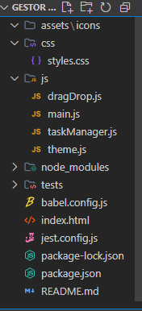

# 📝 Gestor de Tareas

Aplicación web para gestionar tareas con funcionalidades como agregar, eliminar, buscar, filtrar, reordenar con drag & drop y cambiar entre modo claro y oscuro. Guarda tus tareas en el navegador mediante `localStorage`.

## 🚀 Características

- Agregar nuevas tareas con título, descripción, fecha y categoría.
- Eliminar tareas individualmente.
- Filtros por texto y categoría.
- Reordenamiento mediante drag & drop.
- Modo claro / oscuro con botón de alternancia.
- Persistencia en `localStorage`.
- Código modular y estructurado.
- Tests con **Jest** para lógica y almacenamiento.

## 🖼️ Captura

 <!-- reemplaza con la ruta correcta a tu captura -->

## 🛠️ Tecnologías

- HTML5
- CSS3
- JavaScript (modular ES6)
- Jest (testing)

## 📁 Estructura del proyecto




## ▶️ Cómo usar

1. Clona el repositorio:
   ```bash
   git clone https://github.com/NinaGaZu/Gestor-de-tareas.git

2. Abre index.html en tu navegador.

No necesitas servidor, ¡es completamente local!

## 🧪 Ejecutar tests

<pre> ```bash
# Instalar dependencias
npm install

# Ejecutar pruebas
npm test

# Iniciar la aplicación en modo desarrollo (si aplica)
npm run dev
``` </pre>

👩‍💻 Autora
Desarrollado con 💻 y ❤️ por Gianina Gaete (NinaGaZu)
